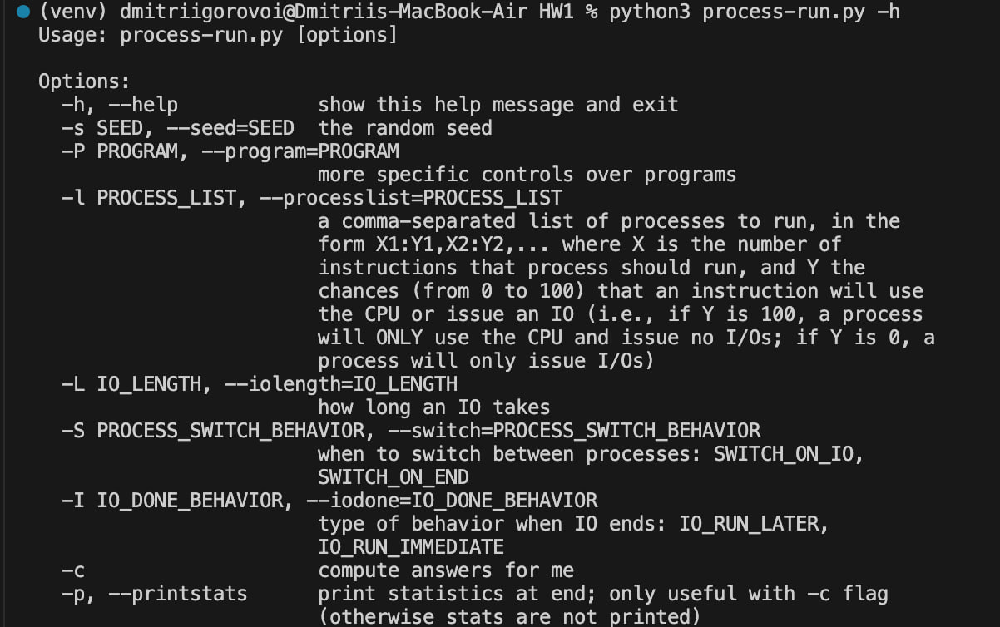
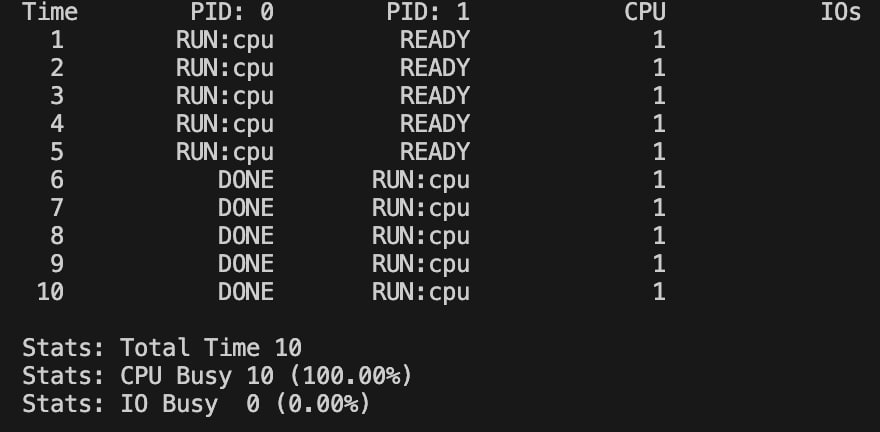
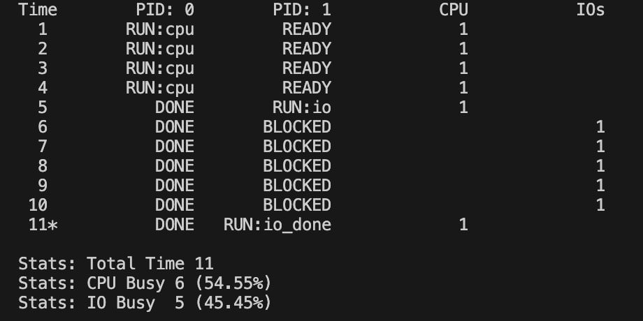
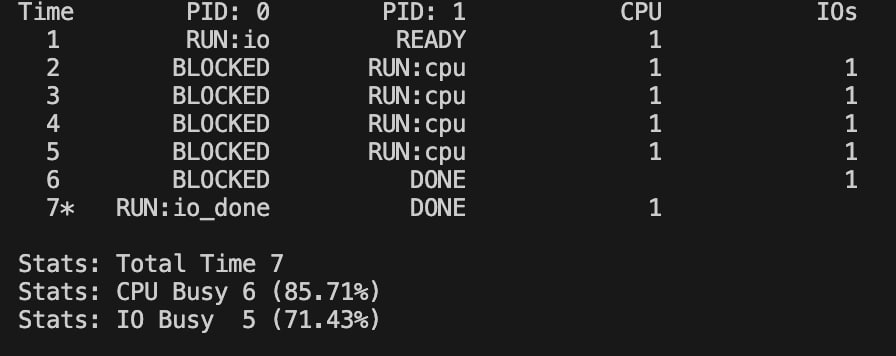
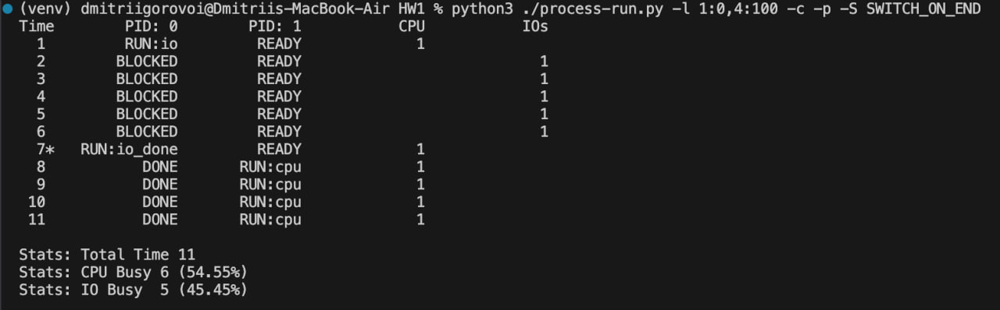
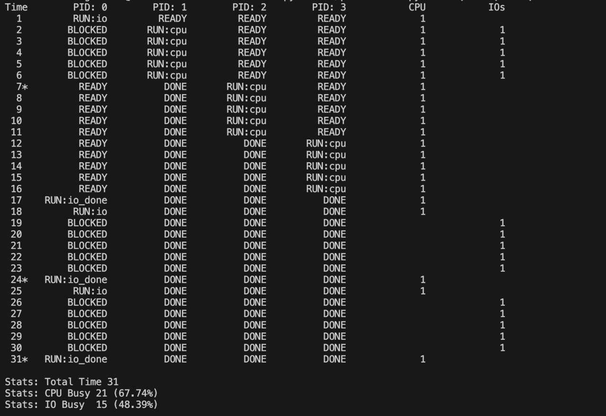
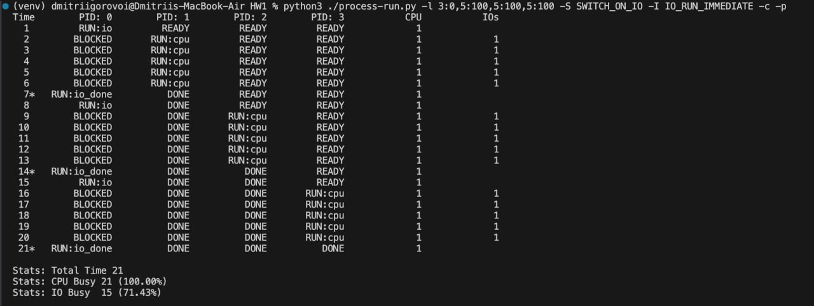

### Exercise 1

a) I chose MacOS as my operating system. As it is the one I am using on my personal computer.
b) Running processes in MacOS can be viewed using the "Activity Monitor" application.
c) I chose "Code" or Visual Studio Code as my process. Relevant information includes:
   - Name: Code
   - User: dmitriigorovoi
   - Process ID (PID): 54820
   - CPU usage: 4,1%
   - CPU time: 19.21
   - Memory usage: 125,8 MB
   - Number of threads: 46

### Exercise 2

a) When process is created this happens:
- Assign an identity: create a new process ID (PID).
- Create and initialize the process control block (PCB).
- Set up the execution context: initialize the program counter, registers, stack pointer, and initial CPU context so it can run.
- Provide resources and address space: create the process address space , set up memory mappings, and apply limits/permissions.
- Inherit or attach OS objects: copy or share things like open files, current directory, environment, credentials, and IPC handles depending on the creation method.
- Make it schedulable: set state to Ready and place it into the appropriate scheduler queue(s) so it can be dispatched.

b) 
- Normal completion: The program finishes its work and calls an exit routine 
- Error or exception: The process hits a runtime error the OS cannot safely recover from, like an illegal instruction, segmentation fault, divide-by-zero, or failed protection check.
- Killed by another entity: A user, administrator, parent process, or the OS requests termination 

### Exercise 3

a) 
To be able to resume the process exactly where it stopped, the OS must save the user-visible CPU context:
- R0, R1, R2, R3 (general registers)
- SP (stack pointer)
- FP (frame pointer)
- Return address for the user code

b) 
When an interrupt occurs while a user process is running, the TOY CPU automatically:
1. Copies PC -> EPC (saves where the user process should resume)
2. Loads PC with the interrupt handler address
3. Switches to system mode
4. Starts executing the interrupt handler

c)
1. Restores the saved user registers (R0-R3, SP, FP) from the PCB
2. Ensures the saved return address is in EPC
3. Executes the special “return to user” instruction, which:
    - Copies EPC -> PC
    - Switches to user mode
    - Continues execution at that PC (right after the interrupted instruction)

### Exercise 4

a)

b)

1)
Expected 100% 
As there are no I/O operations

When ran ``./process-run.py -l 5:100,5:100 -c -p``, the output was:

which matches the expectation.

2)
Expected 4 + 1 + 5 + 1 = 11 ticks
Where 4 ticks for 1st process, 1 tick to run I/O, for 5 ticks process is blocked because of the I/O, and 1 tick to run I/O Done

When ran ``./process-run.py -l 4:100,1:0 -c -p``, the output was:

which matches the expectation.

### Exercise 5

3)
WHen the order is switched processes can run in parallel, meaning that while one process is waiting for I/O the other process can use the CPU.

When ran ``./process-run.py -l 1:0,4:100 -c -p``, the output was:

4)
When -S SWITCH_ON_END is used CPU won't switch to another process until I/O is done so the time will be the sane as in number 2. 

When ran ``./process-run.py -l 1:0,4:100 -c -p -S SWITCH_ON_END``, the output was:

5)
When -S SWITCH_ON_IO is used CPU will switch to another process as soon as I/O starts so the time will be the same as in number 3. 

6) 
When -I IO_RUN_LATER is used io_done will done after CPU processes finish which means long waiting time (when process is READY but io_done was not called yet). The resources are not effectively used as PID 0 is idle for a while.

When ran ``./process-run.py -l 3:0,5:100,5:100,5:100 -S SWITCH_ON_IO -I IO_RUN_LATER -c -p``, the output was:

7)
When -I IO_RUN_IMMEDIATE is used io_done will be called as soon as I/O finishes which means next I/O can start right away after previous one finishes. The resources are used more effectively as PID 0 is idle for a shorter time. This allows to more overlap between CPU and I/O operations.

When ran ``./process-run.py -l 3:0,5:100,5:100,5:100 -S SWITCH_ON_IO -I IO_RUN_IMMEDIATELY -c -p``, the output was:

