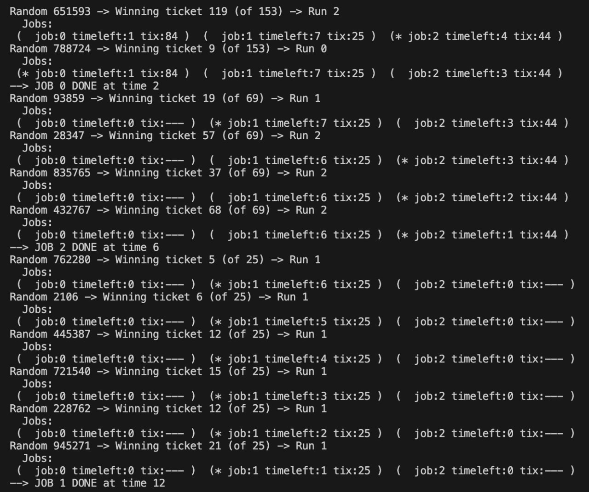
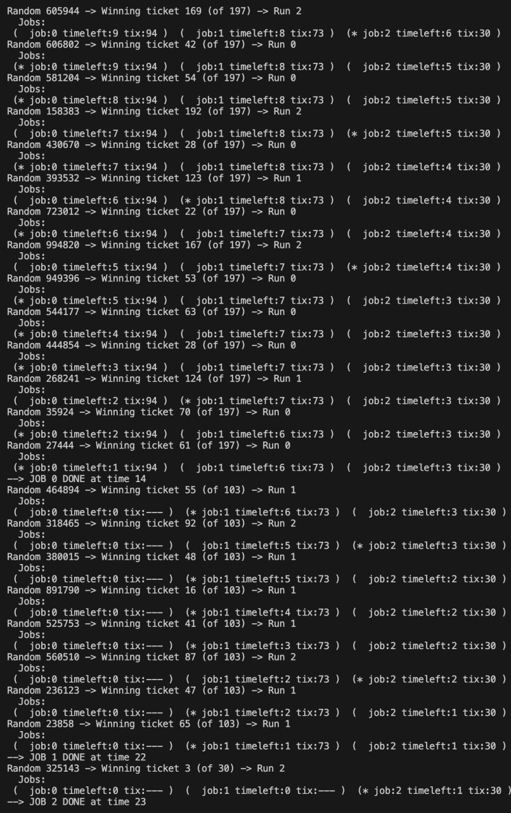
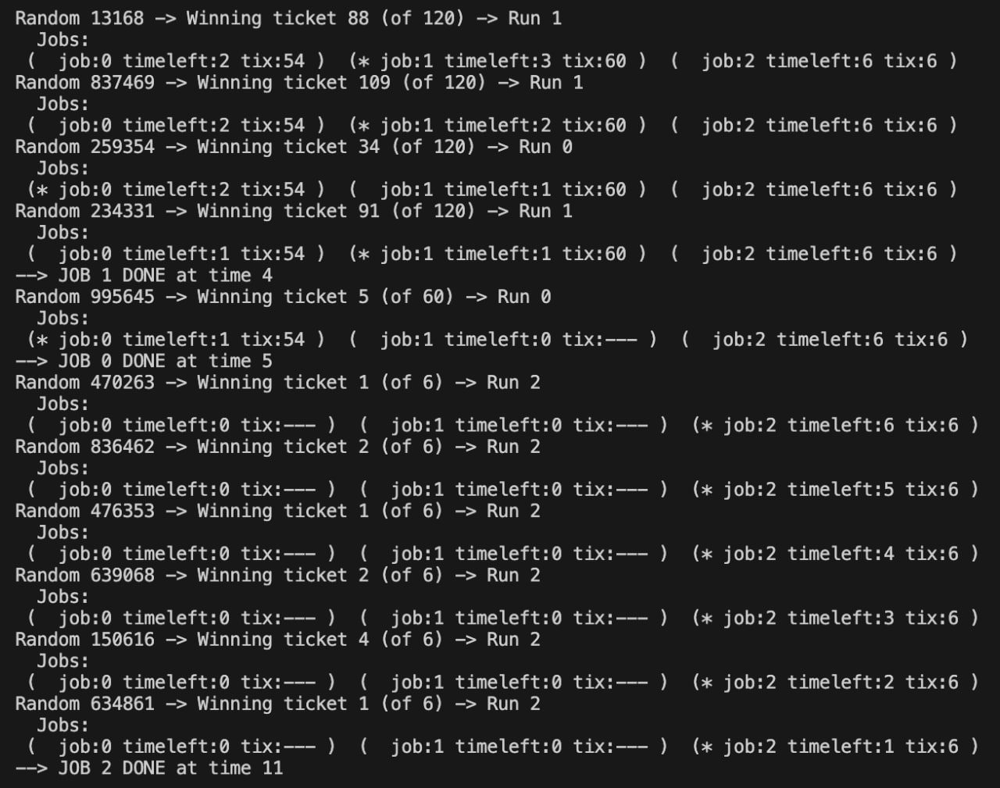
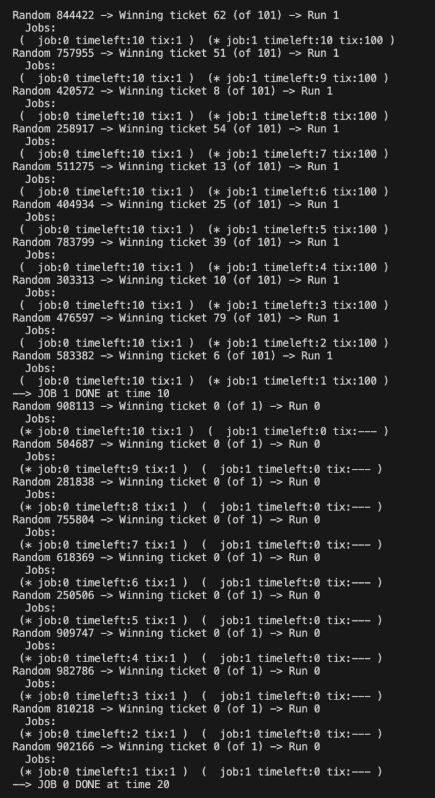

### Exercise 1

a) 2 advantages of multithreading instead of multiprocessing are:
- Lower resource consumption: Threads within the same process share the same memory space and resources
- Faster context switching: Switching between threads is generally quicker than switching between processes due to shared resources.

b) 2 advantages of kernel level threads instead of user level threads are:
- True concurrency: Kernel-level threads can be scheduled independently by the OS, allowing for true parallelism on multi-core processors.
- Better integration with OS services: Kernel threads can take advantage of OS-level features like I/O operations and system calls without the need for additional user-level management.

c) 
if T is ULT:
- kernel blocks entire process P
- all user-level threads in P are blocked

if T is KLT:
- kernel blocks only thread T
- other threads in process P can continue executing

Why the difference? - with ULT scheduling is done by user-level library, kernel is unaware of multiple threads within process P. When one thread blocks, the entire process is blocked. With KLT, the kernel is aware of each thread and can manage them independently.
The KLT is better in this scenario because it allows other threads in the same process to continue executing while one thread is blocked.

### Exercise 2

a)

0-2: A
2-4: B
4-6: C
6-7: D - Finished
7-9: A
9-11: B
11-13: C - Finished
13-14: A - Finished
14-16: B - Finished

Turnaround times:
A: 14
B: 16
C: 13
D: 7
Average turnaround time = (14 + 16 + 13 + 7) / 4 = 12.5

b)

Turnaround times:
A: 5
B: 5 + 6 = 11
C: 11 + 4 = 15
D: 15 + 1 = 16
Average waiting time = (5 + 11 + 15 + 16) / 4 = 11.75

c)
Order: D, C, A, B
Turnaround times:
D: 1
C: 1 + 4 = 5
A: 5 + 5 = 10
B: 10 + 6 = 16
Average turnaround time = (1 + 5 + 10 + 16) / 4 = 8

### Exercise 3

1) 
SEED 1

Job 0: length = 1, tickets = 84
Job 1: length = 7, tickets = 25
Job 2: length = 4, tickets = 44

Total tickets = 153
Total length = 12

SEED 2

Job 0: length = 9, tickets = 94
Job 1: length = 8, tickets = 73
Job 2: length = 6, tickets = 30

TOtal tickets = 197
Total length = 23

SEED 3

Job 0: length = 2, tickets = 54
Job 1: length = 3, tickets = 60
Job 2: length = 6, tickets = 6

Total tickets = 120
Total length = 11

2)

Job 0: length = 10, tickets = 1
Job 1: length = 10, tickets = 100

Total tickets = 101
Total length = 20

The chance that Job 0 gets to run is very low because it has significantly fewer tickets compared to Job 1. It is $$ 1 - \left(\frac{100}{101}\right)^{10} \approx 0.095 $$ In general with such imbalance jobs will just run in order of the tickets they have.

### Exercise 4

1)
30 ms

2)
20 ms

3)
Second column decrease twice as fast after warmup period.

4)
After 9

### Exercise 5

5)
150 ms
scheduler destroys cache locality

6)
110 ms
Runtime significantly improves

7)

Cache size = 50
With 1 CPU
	•	All jobs always cold
	•	Very slow

With 2 CPUs
	•	Still cold, but some parallelism

With 3 CPUs
	•	Still cold, but more parallelism

Speedup is sub-linear or roughly linear.

Cache size = 100
With 1 CPU
	•	Jobs evict each other
	•	Mostly cold

With 2 CPUs
	•	Some improvement
	•	Still interference

With 3 CPUs
	•	Each job gets its own CPU
	•	Each cache warms
	•	All jobs run fast