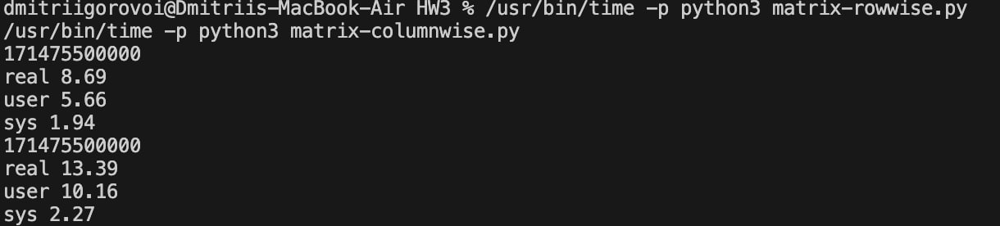

### Exercise 1

a)
Segment number = leftmost 4 bits = top hex digit = 0x2. Offset = remaining 28 bits = lower 7 hex digits = 0x0001111 (same as 0x00001111). Check bounds: 0x0001111 < 0x10000 so valid. Physical address = base(seg 2) + offset:
0x00030000 + 0x00001111 = 0x00031111


b)
Segment number = 0x0. Offset = 0x0001000. Bounds check: segment 0 length is 0x0500, but offset is 0x1000. 0x1000 > 0x0500 so offset is outside segment. Result: trap/exception (segmentation fault), no physical address produced


### Exercise 2

Given: 32-bit virtual addresses, 4 kB pages = 2^12 bytes

a) Virtual address layout
Offset bits = 12 bits (because page size is 2^12). Page number bits = 32 − 12 = 20 bits

So:

- Page number = bits 31..12
- Offset = bits 11..0

b) Translate 0x00001234 using page table

Page table:

 - page 0 → frame 3
 - page 1 → frame 2
 - page 2 → frame 7
 - page 3 → frame 1

For 0x00001234:
Page number = 0x00001234 >> 12 = 0x1. Offset = 0x234. Frame = page_table[0x1] = 0x2. Physical address = (frame << 12) + offset
(0x2 << 12) + 0x234 = 0x2000 + 0x234 = 0x2234

Physical address: 0x00002234

### Exercise 3

4 kB = $2^{12}$ bytes
So every 32-bit logical address is split as:

- VPN (page number) = upper 20 bits = address >> 12
- Offset = lower 12 bits = address & 0xFFF

Given:

Page table:

 - page 0 -> frame 3, M=0, P=1
 - page 1 -> frame 2, M=0, P=1
 - page 2 -> frame 7, M=0, P=0 (not in memory)
 - page 3 -> frame 1, M=1, P=1

TLB

 - entry 0: page 3 -> frame 1, M=1, P=1 (valid)
 - entry 1: page 0 -> frame 3, M=0, P=1 (valid)
 - entries 2 and 3: invalid (P=0)

a) Logical address 0x00001123
	1.	Split into VPN + offset

        VPN = 0x00001123 >> 12 = 0x1
        offset = 0x00001123 & 0xFFF = 0x123

	2.	TLB lookup

	    TLB has valid entries for pages 3 and 0, but not for page 1 -> TLB miss

	3.	Page table lookup for page 1

	    page 1: frame = 0x2, P=1 -> page is present, so no page fault

	4.	Form physical address

	    physical = (frame << 12) + offset = (0x2 << 12) + 0x123 = 0x2000 + 0x0123 = 0x00002123

	5.	Update TLB

	    There is a free (invalid) TLB slot (entry 2 or 3). Put it in the first free slot, say entry 2:
	    entry 2: page 1 -> frame 2, M=0, P=1

Physical address: 0x00002123
TLB updated by inserting page 1 mapping. Page table unchanged.

b) Logical address 0x00002333
	1.	Split into VPN + offset

        VPN = 0x00002333 >> 12 = 0x2
	    offset = 0x00002333 & 0xFFF = 0x333

	2.	TLB lookup

	    No valid entry for page 2 -> TLB miss

	3.	Page table lookup for page 2

	    page 2: frame = 0x7, P=0 -> page fault (page not in main memory)

	4.	Handling the page fault (OS work)

	    The OS loads page 2 from disk into a frame.
	    Since the page table already indicates frame number 7 for page 2, we assume it is loaded into frame 7 (no replacement details were given).
	    Update page table entry for page 2:
	    P becomes 1 (now present)
	    M stays 0 (just loaded, not modified by loading)
        So page 2 becomes: frame 7, M=0, P=1.

	5.	Update TLB

	    Insert mapping into a free invalid slot, say entry 3:
	    entry 3: page 2 -> frame 7, M=0, P=1

	6.	Form physical address

	    physical = (0x7 << 12) + 0x333 = 0x7000 + 0x0333 = 0x00007333

Physical address: 0x00007333
Page table updated (page 2 P:0 -> 1). TLB updated by inserting page 2 mapping.

### Exercise 4


Reference stream (13 refs):
7, 0, 1, 2, 0, 3, 0, 4, 2, 3, 0, 3, 2

Counting rule: “Count page faults only after all frames have been initialized.”
Frames become initialized after the first 3 references (7,0,1).
So we count faults only for the last 10 references: from the 2 onward.

In the diagrams below:
- f = a fault during initial filling (not counted)
- * = a counted page fault (after initialization)

```
Ref:  7  0  1  2  0  3  0  4  2  3  0  3  2
F1:  7  7  7  2  2  2  2  4  4  4  0  0  0
F2:  -  0  0  0  0  3  3  3  2  2  2  2  2
F3:  -  -  1  1  1  1  0  0  0  3  3  3  3
     f  f  f  *     *  *  *  *  *  *      
```

```
Ref:  7  0  1  2  0  3  0  4  2  3  0  3  2
F1:  7  7  7  2  2  2  2  4  4  4  0  0  0
F2:  -  0  0  0  0  0  0  0  0  3  3  3  3
F3:  -  -  1  1  1  3  3  3  2  2  2  2  2
     f  f  f  *     *     *  *  *  *      
```

```
Ref:  7  0  1  2  0  3  0  4  2  3  0  3  2
F1:  7  7  7  2  2  2  2  4  4  4  4  3  3
F2:  -  0  0  0  0  0  0  0  2  2  2  2  2
F3:  -  -  1  1  1  3  3  3  3  3  0  0  0
     f  f  f  *     *     *  *     *  *   
```

```
Ref:  7  0  1  2  0  3  0  4  2  3  0  3  2
F1:  7  7  7  2  2  2  2  2  2  2  2  2  2
F2:  -  0  0  0  0  0  0  4  4  4  0  0  0
F3:  -  -  1  1  1  3  3  3  3  3  3  3  3
     f  f  f  *     *     *        *      
```

### Exercise 5

In most systems and languages, a 2D matrix is stored in row-major order :
	Elements in the same row are stored consecutively. If the matrix is A with indices A[i][j], then in memory you get:
		A[0][0], A[0][1], A[0][2], ... A[0][n-1], A[1][0], A[1][1], ...

So the elements you can expect to be consecutive in memory are A[i][j] and A[i][j+1] (moving left to right within a row)

Accessing columnwise (A[i][j] with i changing fastest) jumps through memory with a stride of one full row, so those elements are not consecutive.

Columnwise is longer because it causes many more cache misses due to poor spatial locality. 

